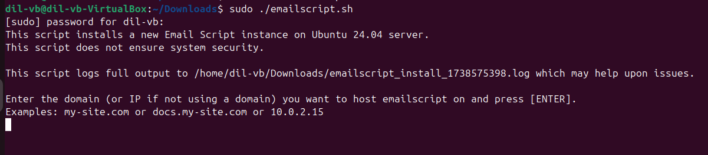
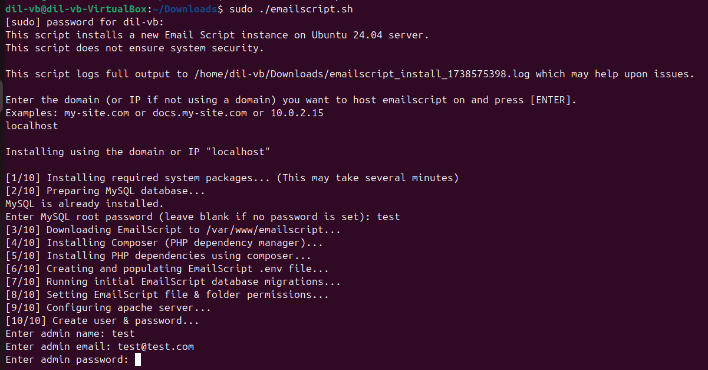
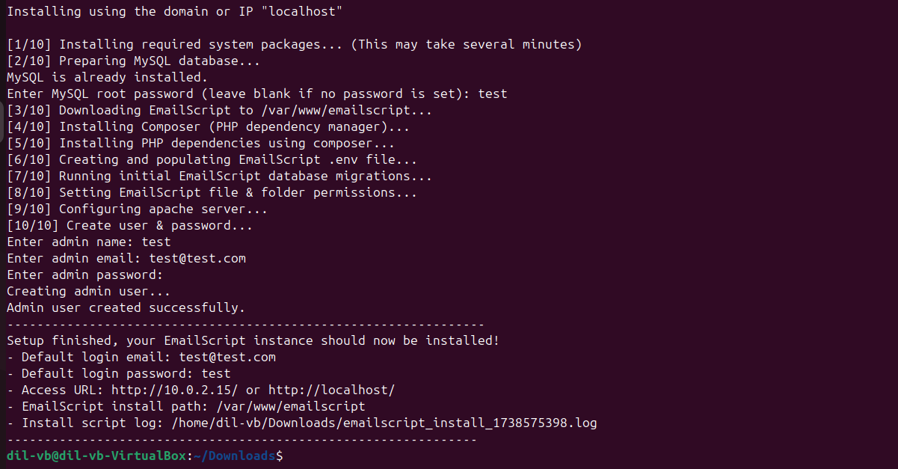

# Option 1: Deployment Guide for Email Script with Docker

## 1. Clone the Project

First, clone the project from the Git repository:

```sh
git clone https://your-repo-url.git
```

Checkout the latest existing branch.

## 2. Set Up Environment

Copy `.env.example` to `.env` in your project directory:

```sh
cp .env.example .env
```

Update the `.env` file with your server’s configuration:

### Database details:

```sh
DB_CONNECTION=mysql
DB_HOST=transaction-email-sys-mariadb
DB_PORT=3306
DB_DATABASE=email-script
DB_USERNAME=root
DB_PASSWORD=root
```

Other configurations like:

```sh
APP_URL=<your-app-url>
APP_ENV=production
```

## 3. Start the Project

Open a new terminal and run the following command:

```sh
make up
```

## 4. Access the Shell

Run the following command to enter the shell:

```sh
make shell
```

Once inside the shell, execute the next steps.

## 5. Install Dependencies

```sh
composer install
```

## 6. Set Permissions

Give the necessary permissions for the storage directory:

```sh
chmod -R 777 storage/
```

## 7. Set Application Key

```sh
php artisan key:generate
```

## 8. Run Database Migrations

Run the migrations with seed data:

```sh
php artisan migrate --seed
```

# Option 2: Deployment Guide for Email Script without Docker

## Prerequisites
- Ubuntu OS

## Installation Steps

1. **Download the Repository**  
   Clone the repository or download the ZIP file from the following link:
   
   [GitHub Repository](https://github.com/DilshikaPriyashan/shell-script-laravel)

2. **Run the Setup Script**  
   Open the terminal and execute the following commands to make the script executable and run it:
   
   ```bash
   chmod +x ./emailscript.sh
   sudo ./emailscript.sh
   ```

3. **Configure Host**  
   You will be prompted to enter `localhost` or any desired IP address. Enter the appropriate value and press `Enter`.
   


4. **Create an Account**  
   Follow the on-screen instructions to create an account.
   

5. **Successful Deployment**  
   If the setup is completed successfully, a confirmation message will be displayed.
   
---

You are now ready to use the Email Script!

